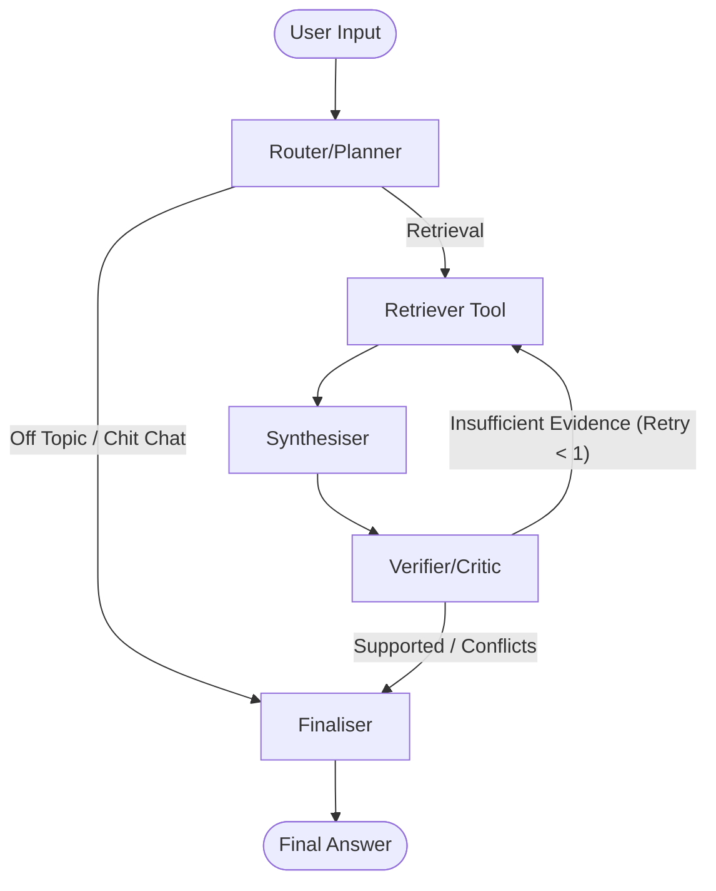

# Kestrel Research Assistant: Design Document

## Architecture

## Shared State
The LangGraph workflow revolves around the `KestrelState` TypedDict, which includes fields like `question`, `history`, `route`, `evidence` (the retrieved chunks), `draft_answer`, `claims` (facts asserted), and `verified_claims`. Each agent selectively reads from the state and returns only the fields it modifies, which LangGraph merges.

## Orchestration Choice
**LangGraph** was selected as the orchestration framework because of its native support for stateful workflows, cyclical graphs, and automatic tracking of conversational context. With LangGraph, we can define deterministic handoffs between specialized agents while maintaining strict typed state. Crucially, it deeply integrates with LangSmith, giving us out-of-the-box visibility into every node transition and LLM call without complex custom callbacks.

## Retrieval Design
Retrieval relies on a **Hybrid** strategy (Dense Vector + Lexical BM25). We use `bge-small-en-v1.5` embeddings via Chroma for semantic search, and `rank_bm25` for exact-match token retrieval. These two result sets are fused using Reciprocal Rank Fusion (RRF). This ensures that highly specific identifiers (like incident IDs or version numbers) can be retrieved accurately alongside conceptual queries. Duplicate chunks are deduplicated by `chunk_id`.

## Conflict Resolution and Stale Documents
The **Verifier/Critic** explicitly compares the `published` date (and `version` string if available) of sources that present conflicting information. When a conflict is detected, the `verifier_verdict` is set to `conflicting_evidence`. The Finaliser is instructed to present both sides to the user, declaring the newer document as more reliable based on its metadata.

## Unsupported Questions
If the Router classifies the query as Kestrel-related but the Retriever fails to find matching evidence, or the Synthesiser cannot draft a well-supported response, the Verifier flags the claims as `insufficient_evidence`. The Finaliser intercepts this state and produces a deterministic statement asserting that the documents do not settle the question, preventing hallucinations.

## Free-Tier Handling
To survive the tight constraints of free-tier LLMs (like Groq), calls are strictly sequential to prevent overlapping rate limits. We use a robust exponential backoff handler integrated directly into `kestrel/llm.py` that listens for HTTP 429 Retry-After headers, scaling up backoff times up to maximum caps. Output lengths are heavily restricted per agent (e.g. 200 tokens for the Router, 400 for Synthesiser) to avoid draining the Tokens Per Minute/Day (TPM/TPD) quotas too fast.
